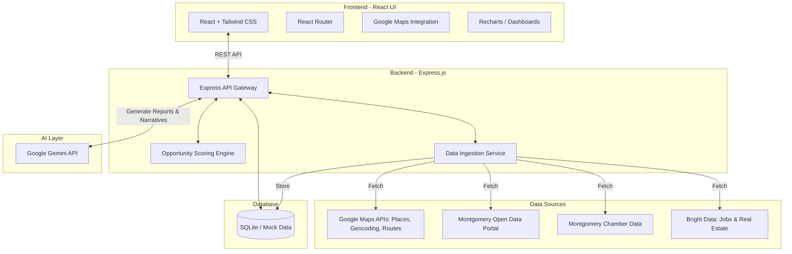

# OpportunityAI Montgomery

**Tagline:** AI discovering the industries Montgomery should attract next.

## Overview

OpportunityAI is a city-intelligence application built for Montgomery, Alabama. It analyzes local economic signals and recommends the top industry opportunities the city should target next. The platform provides evidence-backed insights, interactive maps, workforce fit analysis, site readiness evaluations, and investor-facing AI-generated summaries. 

Montgomery already shows active economic-development momentum, including recent announced capital investment and new jobs, making it a strong pilot city for a market-opportunity detector rather than just a crisis dashboard.

## Problem Statement

City leaders and economic-development teams often know that a city has assets, but they struggle to answer critical questions efficiently:

- **Which industries are the best fit right now?**
- **Which sub-areas of the city are most suitable for these industries?**
- **Which recommendation is supported by real demand, workforce, property, and logistics signals?**
- **How can they defend the recommendation with evidence to investors and policymakers?**

Today, answering these questions is a slow, spreadsheet-heavy process that is fragmented across chamber of commerce websites, local datasets, job boards, and commercial real-estate listings.

## Product Vision

OpportunityAI combines:
- Official city and chamber data
- Google Maps Platform APIs (Places, Geocoding, Routes)
- Bright Data collection from public websites (Job boards, Real estate listings)
- Gemini in Google AI Studio

To generate:
- Top recommended industries for Montgomery
- Explainable opportunity scores
- Area-level location recommendations
- Investor-ready reports
- "Why this industry / why here / why now" narratives

## Architecture Diagram

## Core Features

1. **City Overview Dashboard:** A comprehensive economic profile of Montgomery, showing top employers, industry mix signals, recent growth indicators, and available industrial-site signals.
2. **Opportunity Scoring Engine:** Calculates an Opportunity Score for target industries using weighted dimensions (Workforce Fit, Infrastructure Fit, Property/Site Fit, Demand Momentum, Logistics Accessibility).
3. **Explainability:** Explains each score with top positive drivers, risks, evidence links, and Gemini-generated narrative summaries.
4. **Map Intelligence:** Geographic intelligence showing candidate sub-areas in Montgomery, industrial zones, logistics corridors, and commute-time accessibility.
5. **AI Report Generator:** Generates exportable, executive-ready briefs including recommended industries, top areas, evidence summaries, and risk assessments.
6. **Data Administration:** A dashboard to manage and monitor data ingestion pipelines from various sources.

## Tech Stack

- **Frontend:** React 19, React Router, Tailwind CSS, Framer Motion, Lucide React
- **Backend:** Node.js, Express.js, Vite (Middleware mode for development)
- **AI Integration:** `@google/genai` (Google Gemini API)
- **Deployment:** Docker / Cloud Run compatible

## Getting Started

1. Install dependencies:
   \`\`\`bash
   npm install
   \`\`\`

2. Set up environment variables:
   Copy `.env.example` to `.env` and add your `GEMINI_API_KEY`.

3. Start the development server:
   \`\`\`bash
   npm run dev
   \`\`\`

4. Open your browser and navigate to `http://localhost:3000`.
